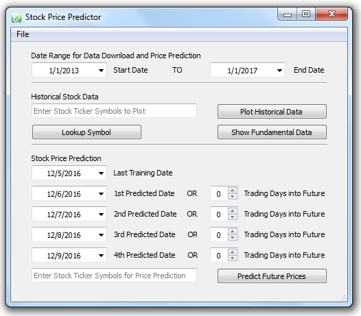

# Stock_Price_Predictor
This capstone project was created as part of [Udacity's Machine Learning Engineer Nanodegree](https://www.udacity.com/course/machine-learning-engineer-nanodegree--nd009). The full description of the project can be found in the .

This project tests the Support Vector Machine (SVM), Random Forest (RF), and K-Nearest Neighbors (KNN) machine learning algorithms to predict future prices of stocks. The final tuned model produced more accurate Adjusted Closing Price predictions than the benchmark for a date that was four days into the future from a requested date for the four companies that were analyzed.

## Technologies used:

Python, Pandas, MatPlotLib, Scikit-Learn, PyQt4, QT Designer

## Screenshots
Below are a few screenshots showing features of this project.

## Installation
The installation documentation for the Jupyter platform can be found [here](https://jupyter.readthedocs.io/en/latest/install.html).
The documentation for advanced usage of Jupyter notebook can be found
[here](https://jupyter-notebook.readthedocs.io/en/latest/).

This project requires **Python 2.7** and the following Python libraries installed:

- [NumPy](http://www.numpy.org/)
- [Pandas](http://pandas.pydata.org)
- [matplotlib](http://matplotlib.org/)
- [scikit-learn](http://scikit-learn.org/stable/)

## Usage - Running Jupyter notebook

### Running in a local installation

Launch with:

    $ jupyter notebook
